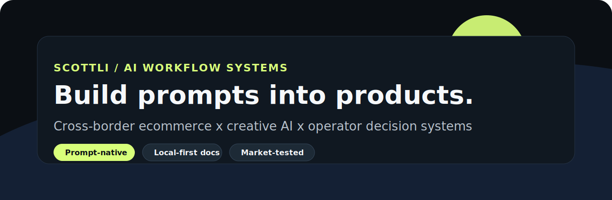

  

  <a href="https://github.com/scotti1i/seedance-2.0-superprompt">Seedance Superprompt</a>
  ·
  <a href="https://github.com/scotti1i/gmv-max-diagnosis-framework">GMV Max Framework</a>
  ·
  <a href="https://www.youtube.com/@ScottGlobalAI">YouTube</a>

  
  
  

## What I Build

I turn messy operator knowledge into AI workflows that can be reused, audited, and improved.

The current focus is cross-border ecommerce, video generation, and decision systems: places where product judgment, market data, and prompt-native tooling have to work together.

## Featured Systems

| Project | What it does | Status |
|---|---|---|
| [seedance-2.0-superprompt](https://github.com/scotti1i/seedance-2.0-superprompt) | A portable prompt skill for writing, auditing, and fixing ByteDance Seedance 2.0 video-generation prompts. | Public / MIT |
| [gmv-max-diagnosis-framework](https://github.com/scotti1i/gmv-max-diagnosis-framework) | A bilingual TikTok Shop GMV Max diagnostic framework built from campaign-level operating experience. | Public / MIT |

## Operating Principles

- Product judgment before implementation.
- Prompts are interfaces, not disposable text.
- Markdown is a product medium when it encodes decisions, workflows, and review rules.
- A good repo should explain the problem, prove the method, and give the user a next action.

## Current Direction

I am building a public body of work around:

- AI workflow systems for operators and creators
- Prompt skills that encode domain judgment
- Cross-border ecommerce diagnosis and automation
- Creative production pipelines for short-form video

Older experiments stay private unless they become useful enough to package as products.

## Contact

- GitHub: [@scotti1i](https://github.com/scotti1i)
- YouTube: [@ScottGlobalAI](https://www.youtube.com/@ScottGlobalAI)
